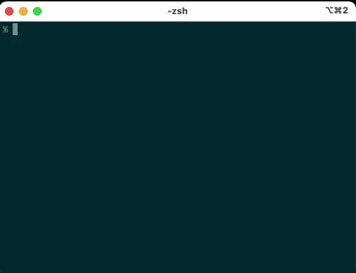
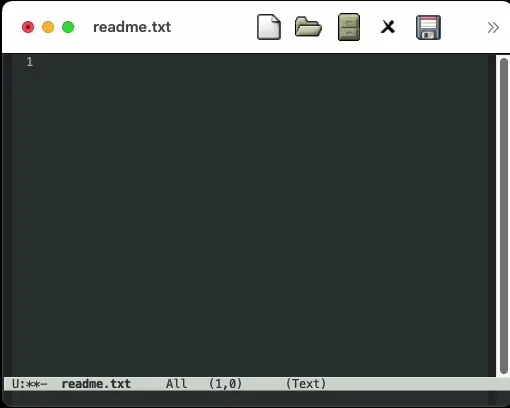

# aici 🚀

[](https://pypi.org/project/aici/) [](https://pypi.org/project/aici/) [](https://opensource.org/licenses/MIT)

a command line i/f tool for the AI like ChatGPT. 🤖💬

Use Case: would like to use ChatGPT with editors like Emacs and/or automated tools.





# 📦 Installation:

`pip install aici`

# 📖 Overview:

This program is based on Python🐍 that queries OpenAI’s ChatGPT model. It takes a user’s prompt as input and outputs the response from ChatGPT. The output can be directed to either standard output or the clipboard📋. Additionally, you can specify the model to use and set a custom system message .

# 💻 Command-Line Description:

| Argument       | env val               | Default                      | Type | Description                                               |
| -------------- | --------------------- | ---------------------------- | ---- | --------------------------------------------------------- |
| -v, --version  |                       | -                            |      | Show version and exit                                     |
| prompt         |                       | -                            | str  | The prompt to send to ChatGPT or "-" to read from stdin   |
| -m, --model    | OPENAI_CHATGPT_MODEL  | gpt-4o                       | str  | model name                                                |
| -c, --complete |                       | False (default streaming)    | bool | get a message when completed                              |
| -s, --system   | OPENAI_CHATGPT_SYSTEM | You are a helpful assistant. | str  | specify the content value of role:system for the chat API |
| -o, --output   |                       | stdout                       | str  | output destination, "clip" for clipboard                  |

[chatgpt model document](https://platform.openai.com/docs/models)

## 📥 input

💻 std input
💬 command parameter

## 📤output

💻 std output (streaming, beffering)
📋 clipboard

# 🔧 Config Environment Variables or File:

🔑 it can be chosen using environment variable OPENAI_API_KEY or config file

```
set OPENAI_API_KEY=sk-xxxxxxxxxxxxxxxxx
```

it will check the files in the following locations (in the order listed below).
~/.config/aici/config ~/.aici

```
OPENAI_API_KEY=sk-xxxxxxxxxxxxxxxxx
```

🖥️ On Windows file path, it is expanded like
| File path| Windows Specific|
|--------------------------------------------------|:--:|
| `C:\Users\{USERNAME}\AppData\Local\aici\config` |✔ |
| `C:\Users\{USERNAME}\AppData\Roaming\aici\config`|✔ |
| `C:\Users\{USERNAME}\.config\aici\config` | |
|`C:\Users\{USERNAME}\.aici` | |
(The priority of the applied config files is in the order listed from top to bottom.)

# 👋 Examples:

💨 input from cli

```
$ aici Hello
```

💨 read from stdin

```
$ echo Hello | aici -
```

💨 output to clipboard 📋

```
$ echo Hello | aici - --output clip
```

# 👋 emacs

## Emacs Lisp Code Example

Below is the content of `emacs/aici.el`

```elisp

(defun aici-call ()
  "Send selected region or prompt for input if no region is selected to the 'aici' command and insert the output in real-time."
  (interactive)
  (let* ((text (if (use-region-p)
                   (buffer-substring-no-properties (region-beginning) (region-end))
                 (read-string "Enter text: ")))
         ;; Attempt to create or get the output buffer
         (output-buffer (get-buffer-create "*AICI Output*")))

    ;; Check if the buffer creation was successful
    (if (not output-buffer)
        (error "Failed to create or access the output buffer")
      ;; Clear the output buffer
      (with-current-buffer output-buffer
        (erase-buffer)
        ;; Set the buffer to markdown-mode
        (markdown-mode))

      ;; Display a message indicating that processing is ongoing
      (message "Processing...")

      ;; Start the process and stream the output to the buffer
      (let ((process (start-process "aici-process" output-buffer "sh" "-c"
                                    (format "echo %s | aici -" (shell-quote-argument text)))))
        ;; Set a process filter to handle output streaming
        (set-process-filter process
                            (lambda (proc output)
                              ;; Explicitly reference the output-buffer by capturing it in the lambda
                              (let ((buffer (process-buffer proc)))
                                (when (buffer-live-p buffer)
                                  (with-current-buffer buffer
                                    (goto-char (point-max))
                                    (insert output)
                                    ;; Optionally display the buffer in real-time
                                    (display-buffer buffer))))))

        ;; Set a sentinel to handle process completion
        (set-process-sentinel process
                              (lambda (proc event)
                                ;; Again, ensure that output-buffer is properly referenced
                                (let ((buffer (process-buffer proc)))
                                  (when (buffer-live-p buffer)
                                    (if (string= event "finished\n")
                                        (message "Processing complete.")
                                      (message "Processing interrupted: %s" event))))))))

      ;; Ensure the output buffer is displayed after starting the process
      (display-buffer output-buffer)))

```

## License

This project is licensed under the MIT License - see the [LICENSE](LICENSE) file for details.
